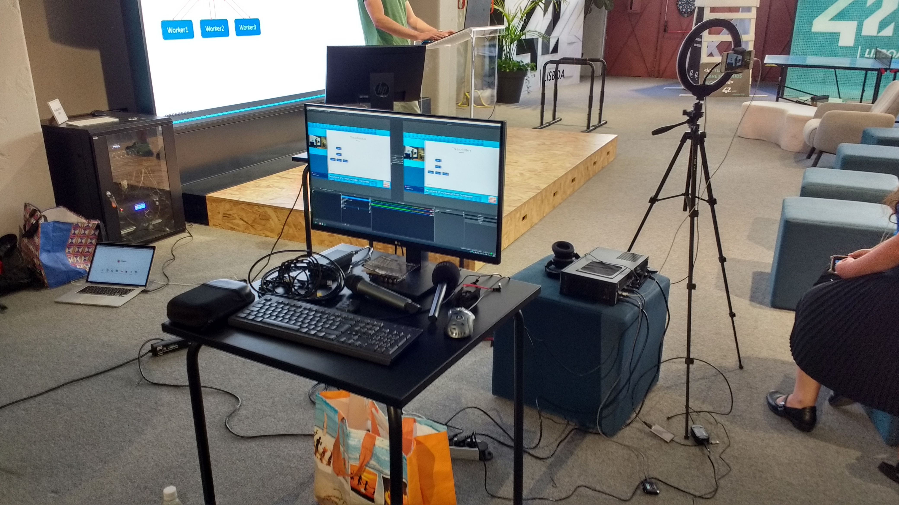

<aside markdown="1">
  If you enjoy my work, consider sponsoring me so I can keep on doing this full
  time: <https://github.com/sponsors/hugopeixoto>
</aside>

I volunteered to be the AV team at [Gambiconf](https://gambiconf.dev/), an
in-person conference in Lisbon. Some things didn't go exactly as planned, so
here's a summary of how things went.

## The original plan

We wanted to capture the speaker's voice, computer screen, and have a camera
pointed at the stage. We also wanted to livestream the whole thing. The
organizers told me the venue had a large screen, so no need to bring an image
projector.

The plan was to use OBS on a dedicated Mini-ITX computer with a bunch of USB-C
ports. Then, a Canon camera with "clean HDMI" output would be connected via an
HDMI to USB-C capture adapter. We had a wireless microphone whose receiver was
connected via 3.5'' to the camera, so that everything would be synced. Then,
the idea was to use an AverMedia LGP 4k to intercept the speaker's computer
connection to the TV and stream it to the OBS machine over USB-C.

Like every plan, it didn't survive first contact.

## OBS machine issues

I purchased most of the pieces recently, but the hard drive was the one from my
[backup server][backup-server]. This was a mistake. It is slow, causing the
full disk encryption unlocking to take around five minutes. If I mistyped the
passphrase, I had to wait 5 minutes before being able to try again. I've since
added an m.2 SSD so I won't have the same issues again.

## Computer screen

I arrived at the venue and hit the first issue almost immediately: the screen
had a weird resolution of 1366x768. My fedora powered macbook pro was able to
connect to it, but the organizer's computer (running windows, afaik) was having
trouble and the AverMedia device also doesn't support that resolution. I tried
to replace the AverMedia with a backup HDMI splitter, but it also didn't work.

As a last resort, we tried [VDO.Ninja][vdo], which uses WebRTC to transmit
video peer to peer. We connected my laptop to the venue's screen, loaded
VDO.Ninja on both laptops and used the screenshare functionality to cast the
speaker's screen on the venue's big screen. We had to enable the 1080p option
in VDO.Ninja for things to work, otherwise it would default to a low
resolution. This worked great, except when one of the speaker was using a VPN,
causing some lag between what they had on their computer and what showed up on
the big screen.

The VDO.Ninja solution also made it easy to plug the computer screen stream
into OBS, as I could just load the same URL as a browser source.

## Camera

I had a Canon camera with me with clean HDMI output. I connected it to the OBS
machine with a hdmi2usb capture thingie, and it seemed to work... most of the
time. If I turned off the camera or temporarily unplugged the cables, OBS would
show a blank screen. The camera stream also turned black once after some
minutes of operation.

Sometimes, removing and adding the camera source would solve the problem.
Sometimes, I'd have to reboot the OBS machine. Instead of relying on this and
having to reboot things mid-talk, I switched to a different plan: use a backup
smartphone and stream its camera source with VDO.Ninja. Not as fancy as a
Canon, but it worked, without any timeouts or disconnections. I forgot to bring
a smartphone clamp, but fortunately someone had one of those light ring tripods
that we could use.

There were some sound issues: the smartphone was emitting some sort of
feedback. I could hear my fingers whenever I touched it, like it was monitoring
its own microphone. I couldn't figure out a way to disable that, so I lowered
the volume as far as I could to minimize the issue.

Another advantage of using a smartphone with VDO.Ninja is that we were no
longer needed a cable connecting the camera to the OBS machine. This gives us
more freedom in placing the camera.

## Speaker's microphone

The plan was to use a Rode Go microphone system, connecting the receiver to the
camera. Since we were no longer using the camera, I connected it directy to the
mic port on the OBS machine.

At first I was confused because I could hear people talking, but talking
directly to the Rode wouldn't be significantly louder. After a while I figured
out that the sound was coming from the smartphone stream instead. After
removing that audio source, I still couldn't hear anything, but eventually
found that the receiver had the output pad set to -24dB. After changing this to
-9dB, things worked fine.

## Conclusions

The first takeaway was that having a backup plan pays off. The AverMedia had
the HDMI splitter and VDO.Ninja fallback options. The camera had the smartphone
fallback option. I didn't have a backup plan for the OBS machine and the
microphones, but those were the pieces less likely to fail.

Another takeaway was that being a single-person AV team isn't really feasible.
I had to recruit someone to monitor the livestream, someone to help me debug
the audio problems, and the organizer set up the OBS layout himself.

The whole thing was very tiring, but rewarding. My day started at 5AM and ended
at 2AM because I had to travel from Porto to Lisbon and back, I spent most of
the morning on my knees messing with cables, and I was monitoring everything
during the afternoon. Nevertheless, it was a fun experience, I met some
interesting folks, and now I know what works and what needs improving.

You can check the final result on [GambiConf's youtube
channel](https://www.youtube.com/watch?v=EVJZavbMThs). I really enjoyed the
talks that I managed to watch, so I recommend checking them out. Here's a
picture of final setup:

<aside markdown="1">
  If you enjoy my work, consider sponsoring me so I can keep on doing this full
  time: <https://github.com/sponsors/hugopeixoto>
</aside>

[backup-server]: /articles/upgrading-my-backup-servers-hard-drive.html
[vdo]: https://vdo.ninja
