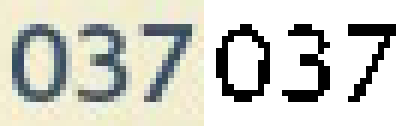
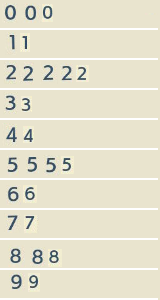

<aside markdown="1">
  If you enjoy my work, consider sponsoring me so I can keep on doing this full
  time: <https://github.com/sponsors/hugopeixoto>
</aside>

## Introduction

After rewriting Cyberscore, I wanted to actually submit some scores
to the website. The latest game I've been playing is [Pokémon Legends:
Arceus][pla-wp], which has around [3000 score charts on Cyberscore][pla-cs]. I
didn't feel like submitting that many records manually, so I started working on
a tool to automate it instead.

Most of these scores come from the pokédex. Each pokémon species has a pokédex
entry with two pages. The first page shows some generic information like name,
type, preferred foods, and also showing the minimum and maximum weights and
heights of every specimen you caught:

The second page shows the research tasks associated with that species and the
research level you've reached:

In these two screenshots alone, there are at least 12 scores that can be
submitted to Cyberscore: weight and height ranges (4), research level (1), and
research tasks (7, the last one is a game quest and doesn't count). Cyberscore
also allows you to upload screenshots or videos as proof of your high scores,
so detecting the scores from the screenshots and automatically submitting both
sounded like a good idea.

There's already a [user-contributed tool for New Pokémon Snap][psnap-ocr] that,
using Python and OpenCV, takes a bunch of screenshots and generates a CSV with
the scores. Lots of folks use it, but I wanted something integrated directly on
the website to avoid the step of having to install something locally; just
upload all the screenshots, confirm that the detection had no errors, and
you're done.

This post will go over two things: the process of extracting the scores from
the JPG in rust, and the process of embedding it in Cyberscore's frontend.

Link to the source code and a demo video at the end of the post.

## Detecting scores from screenshots

Detecting scores was not that hard: since we're handling game screenshots, the
information is always in the same spots and with little pixel variance. The
first step was to figure out what I had to detect. The first thing was to find
out which of the five pokemon in the list was the selected one and read its
pokédex number. Then, I had to know which pokédex page was being shown (there
are three possible pages) and read the right numbers depending on the page.
This gives us the following rectangles to work with:

To figure out which of the five pokémon species is selected, I calculated the
average color of the top rows of each of those five rectangles on the selection
list and found the one closest to white. I averaged each RGB channel
independently and calculated their distance to 255. I could probably have
calculated the average brightness and used that instead as well, there are many
ways to do this particular operation in this case, I just picked whatever
worked first.

The next step was to detect the actual pokédex number. I started with the usual
thresholding operation, which looks like this:

To find the individual digits in the black and white version, I detected all
groups of connected pixels using a [Disjoint-set data structure][dj-wp]. For
each digit, this would give me a set of pixels (with their positions
arbitrarily anchored of the top-left corner of its own bounding box). To detect
which digit each set represents, I started by grabbing a bunch of samples for
each digit from some screenshots and built a PNG with them:

Applying the same thresholding and connected pixels detection to this template,
I could find the one that more closely matched the digit being detected using
[Template Matching][tm-wp]. In short, this algorithm goes through each pixel
inside the bounding box of both the template and the digit, finds how many
pixels match, and returns the best candidate. Ordering the digits by
x-coordinate would give me `[0, 3, 7]`, which is easily converted to `37`.

I applied the same technique to the other pokédex page. It needed some extra
code because sometimes the weights and heights only contain a single number
instead of a range, but using some regular expressions on the detected text
solved the problem.

To tell which pokédex page is selected (general info or research tasks), I
detected where the `A` in the top left tabs is located using template matching
in both possible locations.

The end result of this process was a library with the following interface
(omitting a few attributes for clarity):

~~~rust
pub struct PokemonLegendsArceusOCR {}

impl PokemonLegendsArceusOCR {
  pub fn new(a: image::DynamicImage, b: image::DynamicImage, c: image::DynamicImage);
  pub fn selected_page(&self, proof: image::DynamicImage) -> Option<PokedexPage>;
  pub fn research_tasks(&self, proof: &image::DynamicImage) -> Option<ResearchTaskProof>;
  pub fn info(&self, proof: &image::DynamicImage) -> Option<InfoProof>;
}

pub enum PokedexPage {
    Info,
    ResearchTasks,
}

pub struct ResearchTaskProof {
    pub dex: usize,
    pub tasks: Vec<u32>,
}

pub struct InfoProof {
    pub dex: usize,
    pub weight: Weight,
    pub height: Height,
}

pub struct Weight {
    pub min: u32,
    pub max: u32,
}

pub struct Height {
    pub min: u32,
    pub max: u32,
}
~~~

All those images in the constructor are the different classification templates
used in each function.

## Compiling it to WebAssembly

To get started, I followed [MDN's guide on "Compiling Rust to
WebAssembly"][wasm-mdn] and installed `wasm-pack`, and adapting `Cargo.toml`:

~~~toml
[lib]
crate-type = ["lib", "cdylib"] # added cdylib

[dependencies]
image = "0.24.1"

# added these three libraries
wasm-bindgen = "0.2"
js-sys = "0.3.56"
console_error_panic_hook = "0.1.7"
~~~

To get my library working in WebAssembly, I started by simplifying the API to a
single function that takes a array of bytes that represent the proof jpg and
returns whatever it detects. To make things easier, the training images were
embedded in the program using the `include_bytes!` macro.

~~~rust
#[wasm_bindgen]
pub fn ocr_pla_dex(proof: &[u8]) -> Proof;

#[wasm_bindgen]
pub struct Proof {
    #[wasm_bindgen(getter_with_clone)]
    pub research: Option<ResearchTaskProof>,
    pub info: Option<InfoProof>,
}

#[wasm_bindgen]
pub struct ResearchTaskProof {
    pub dex: usize,
    #[wasm_bindgen(getter_with_clone)]
    pub tasks: Vec<u32>,
}
~~~

Structs with `wasm_bindgen` automatically generate getters and setters for
every public member, but for that to work those members must implement `Copy`.
Since `Vec` doesn't implement that trait, I needed to use `getter_with_clone`
clones the object instead. Thanks to its `Vec` member, `ResearchTaskProof` is
also not `Copy`able, so I had to do the same to `pub research`.

With this, I was able to run `wasm-pack build --target web` and get a bunch of
files in `pkg/`, including `pla_ocr.js` and `pla_ocr_bg.wasm`.

~~~html

~~~

The `wasm` file is loaded by `pla_ocr.js` using a relative URL, but it can be
passed to `init` if the location is different.

After some tinkering with Cyberscore's code, I managed to fully integrate the
proof OCR library into the website and everything is working fine. Here's a
video of the final result:

<video controls>
  <source src="pla-ocr.mp4" type="video/mp4" />
</video>

## Conclusions

The hardest part of this was probably all the extra javascript to match the OCR
results to cyberscore's charts. There are some edge cases that I had to handle,
like not submitting scores that are zero, or not submitting scores that are
worse than what was previously submitted. The next step would be to find a way
to generalize this to support multiple games.

Other players started using this tool and apart from making it way easier to
submit scores, it reduced the number of mistakes they made during data entry.

The source code for the rust portion of this project is available at
<https://gitlab.com/cyberscore/auto-proofer>. The Javascript part is not
available, since Cyberscore is not free software yet, but the most relevant
bits are described above.

If you're interested in computer vision stuff, check out my [Rustconf 2021 talk
on Identifying Pokémon Cards][rustconf]. It covers a very different use case
but it goes through some basics of image processing and common algorithms of
the field.

<aside markdown="1">
  If you enjoy my work, consider sponsoring me so I can keep on doing this full
  time: <https://github.com/sponsors/hugopeixoto>
</aside>

[pla-wp]: https://en.wikipedia.org/wiki/Pok%C3%A9mon_Legends:_Arceus
[pla-cs]: https://cyberscore.me.uk/game/2874
[psnap-ocr]: https://github.com/KYU49/PSnapOCR
[dj-wp]: https://en.wikipedia.org/wiki/Disjoint-set_data_structure
[tm-wp]: https://en.wikipedia.org/wiki/Template_matching#Template-based_approach
[wasm-mdn]: https://developer.mozilla.org/en-US/docs/WebAssembly/Rust_to_wasm
[rustconf]: https://hugopeixoto.net/articles/rustconf2021-video-available.html
